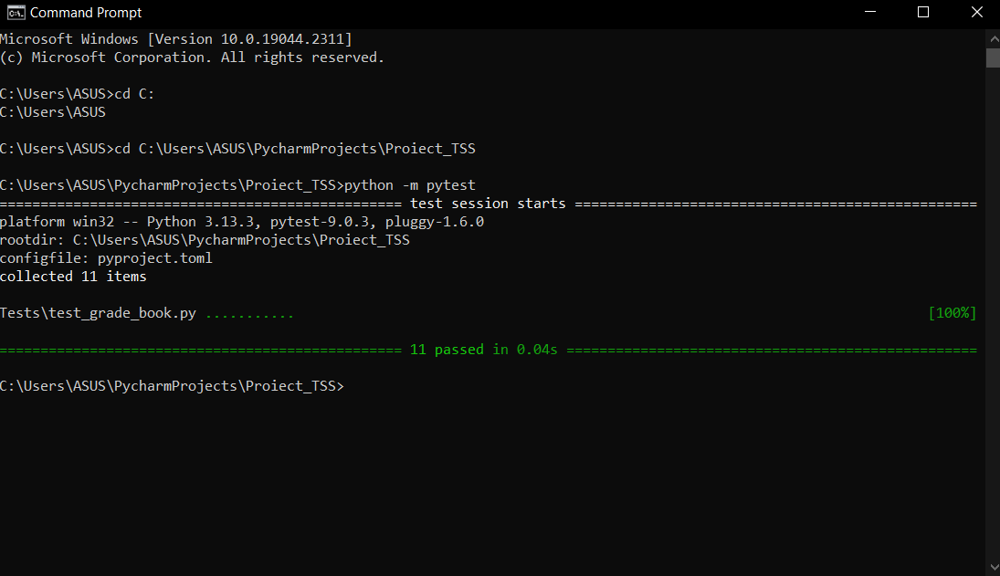

# Proiect: Testarea NoteBook# Prezentare generală

Acest proiect este o aplicație simplă NoteBook construită folosind Python.

Aplicația permite adăugarea de note pentru studenți și calcularea unei medii.

Proiectul a fost creat pentru cursul Sisteme de testare software.

--- #### Tehnologii utilizate

- Python 3.13
- pytest
- mutmut

--- ##### Strategii de testare

Tehnicile de testare utilizate au fost următoarele:
- Partiționarea echivalenței
- Testarea valorilor limită
- Teste unitare
- Dezvoltare bazată pe teste

--- ## Organizarea aplicației Projectapp/ -> cod sursă
Teste/ -> teste unitare ```

--- ## Implementarea proiectului

Instalarea dependențelor:
````bash pip install requirements.txt ```

Rularea testului:
````bash python -m pytest ```

Rularea testării mutațiilor:
````bash mutmut run ```

--- ### Testarea mutațiilor

Testarea mutațiilor a fost efectuată manual și automat folosind mutmut. Am dezvoltat o serie de mutanți și i-am verificat cu suita de teste actuală.

--- ## Utilizarea inteligenței artificiale

Am folosit ChatGPT pentru:
- găsirea de idei de testare
- exemple de testare a mutațiilor
- îmbunătățirea documentației

## Screenshots

### Pytest Rezultate


### Mutation Testare


### Mutmut Rezultate

###  Proiect Pycharm
