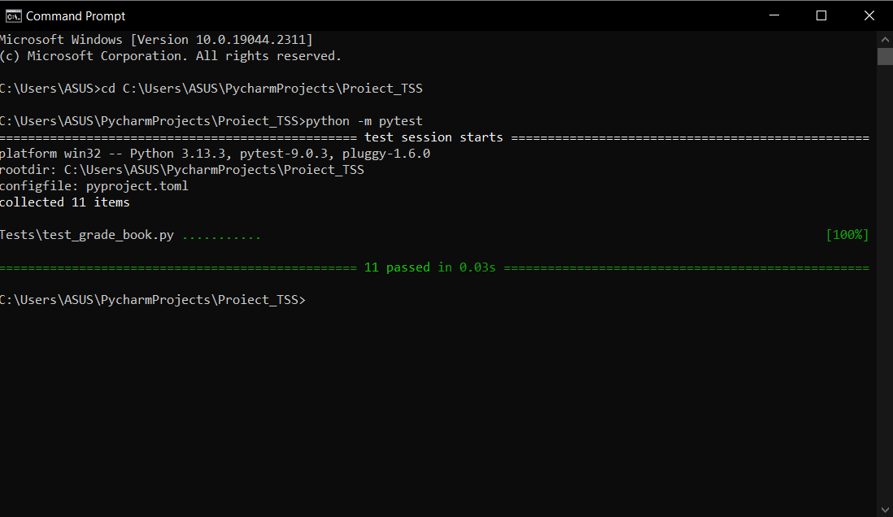
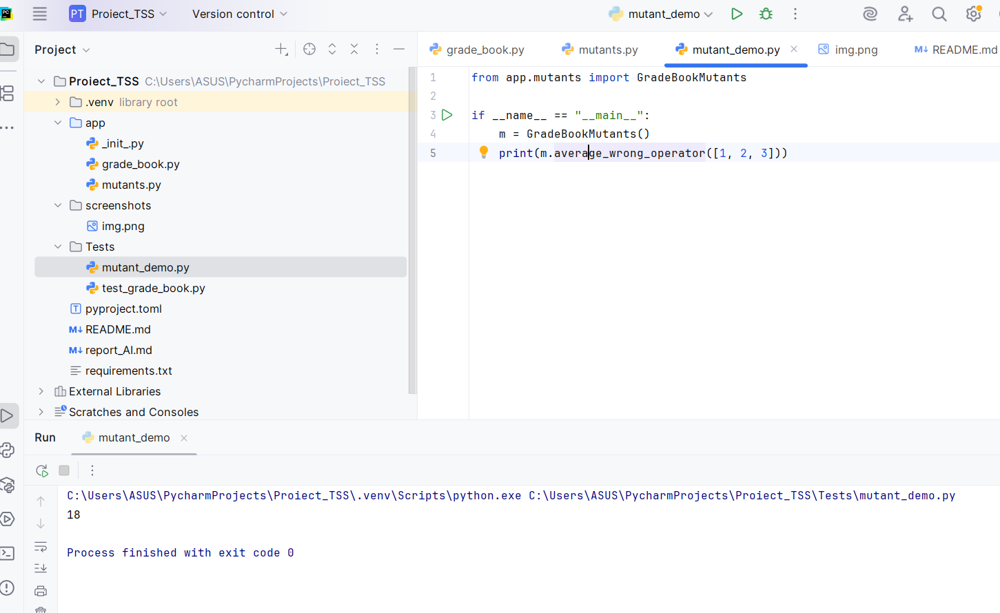

# Proiect de testare a caietului de note

## Descrierea proiectului

Acest proiect a fost creat pentru cursul de Testare software.

Aplicația simulează un sistem simplu de gestionare a notelor studenților, unde se pot adăuga notele, se pot calcula mediile și se poate verifica statutul studentului.

Proiectul demonstrează, de asemenea, multiple tehnici de testare software:

* Partiționarea echivalenței
* Analiza valorilor limită
* Acoperirea deciziilor și condițiilor
* Acoperirea declarațiilor
* Acoperirea buclelor / circuitelor
* Testarea mutațiilor

---

# Structura proiectului

```text
Proiect_TSS/
│
├── app/
│ ├── grade_book.py
│ └── mutants.py
│
├── Teste/
│ ├── test_grade_book.py
│ └── mutant_demo.py
│
├── capturi de ecran/
│ ├── tests_passed.png
│ ├── manual_mutant.png
│
├── README.md
├── report_AI.md
├── requirements.txt
└── pyproject.toml
```

---

# Instalare

Creează un mediu virtual:

```bash
python -m venv .venv
```

Activează mediul:

```bash
.venv\Scripts\activate
```

Instalează dependențele:

```bash
pip install -r requirements.txt
```

---

# Rulează teste

Rulează toate testele folosind pytest:

```bash
pytest
```

Rezultat așteptat:

```text
10 trecut
```

---

# Testarea mutațiilor

## Mutanți manuali

Manual Mutanții au fost implementați în:

```text
app/mutants.py
```

Demo-ul mutant poate fi executat cu:

```bash
python Tests/mutant_demo.py
```

# Capturi de ecran

## Execuție Pytest



---

## Execuție manuală Mutant




---

# Tehnologii utilizate

* Python
* Pytest
* Testarea mutațiilor
* GitHub
* PyCharm